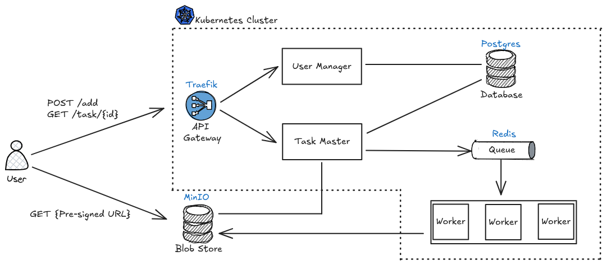

# Fractal Animation Server

<!--
## Notes

- RBAC grants access to pods
- An Ingress is a Kubernetes resource that define rules for routing external HTTP(s) traffic to services inside the
  cluster.
- An Ingres Controler is the actual gatekeeper — the thing that listens on port 80/443 and knows what to do based on the
  Ingress rules. Example: traefik. It reads Kubernetes Ingress resources. Then it dynamically configures itself to
  route traffic to the appropriate services.
- The traefik's NodePort exposes Traefik on a fixed port outside of the cluster.
- `172.17.0.1`, that’s the default gateway IP of the Docker bridge network on Linux/macOS

-->
