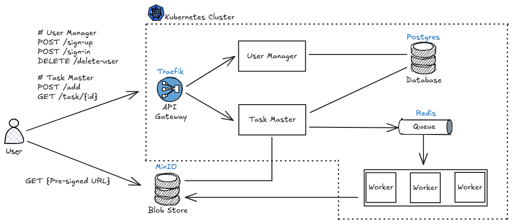

# Fractal Animation Server

<!-- TABLE OF CONTENTS -->

  
Table of Contents

  <ol>
    <li>
      <a href="#about-the-project">About The Project</a>
      <ul>
        <li><a href="#key-features">Key Features</a></li>
        <li><a href="#use-cases">Use Cases</a></li>
        <li><a href="#built-with">Built With</a></li>
      </ul>
    </li>
    <li>
      <a href="#getting-started">Getting Started</a>
      <ul>
        <li><a href="#prerequisites">Prerequisites</a></li>
        <li><a href="#installation">Installation</a></li>
        <li><a href="#usage">Usage</a></li>
      </ul>
    </li>
  </ol>

## About The Project

__Fractal Animation Server__ is a service that generates and serves fractal visualizations (e.g. Julia set animations)
on demand. The application features a modern service-oriented design, exposing a simple RESTful API for users to request
Julia set animations in MP4 format. The high-level system design of the service is shown below:

For example, a 5-second animation starting with the Julia set defined at $c = (-0.80, -0.18)$ is shown below:

https://github.com/user-attachments/assets/075da75b-eb61-40b1-81c0-5516d780bc2e

### Key Features

__API-driven__: Users can request animated fractals via RESTful endpoints. At present, the only supported fractal is the
Julia set. The resulting animation is returned in MP4 format, showing how the Julia set evolves as parameters vary.

__Microservice Architecture__: The system is built as a set of Python-based microservices running inside a `Kubernetes`
cluster with `Traefik` as the ingress controller. User requests are received via REST endpoints, queued in a `Redis`
queue for processing, and handled by worker services that generate Julia set animations. User and task metadata are
persisted in `Postgres`, while the rendered MP4 files are stored in `MinIO` (object storage). Users can retrieve their
completed fractal animations directly from the object storage via pre-signed URLs.

__Authentication__: Users create accounts and are authenticated securely. Upon login, a JSON Web Token (JWT) is issued,
which the client includes in subsequent requests.

__Extensible architecture__: Easily extendable with new fractal types (e.g. Burning Ship, Newton fractals).

### Use Cases

- __Educational Material__: If you’re interested in learning how to build the backend of a microservice architecture on
  Kubernetes, take it apart, explore it, and study how it works from the inside.
- __Creative art__: Generate unique Julia set animations defined at different points of the complex plane.

### Built With

* [![Python][Python]][Python-url] [![FastAPI][FastAPI]][FastAPI-url] [![SQLAlchemy][SQLAlchemy]][SQLAlchemy-url]
* [![Docker][Docker]][Docker-url] [![Kubernetes][Kubernetes]][Kubernetes-url]
* [![Postgres][Postgres]][Postgres-url] [![Redis][Redis]][Redis-url]
* [Kind][Kind-url] (local Kubernetes deployment)
* [Traefik][Traefik-url] (ingress controller)
* [MinIO][MinIO-url] (open source object storage)

(<a href="#readme-top">back to top</a>)

## Getting Started

To get a local copy up and running follow these simple steps.

### Prerequisites

- [Kubectl](https://kubernetes.io/docs/reference/kubectl/)
- [Docker](https://www.docker.com/)

__Important__: The application was tested on Ubuntu 24.04. Install the Docker engine without using tools such as Docker
Desktop or Rancher Desktop.

### Installation

### Usage

(<a href="#readme-top">back to top</a>)

<!-- MARKDOWN LINKS & IMAGES -->

[Kubernetes]: https://img.shields.io/badge/kubernetes-326CE5?&style=plastic&logo=kubernetes&logoColor=white

[Kubernetes-url]: https://kubernetes.io/

[Python]: https://img.shields.io/badge/python-3670A0?style=for-the-badge&logo=python&logoColor=ffdd54

[Python-url]: https://www.python.org/

[Redis]: https://img.shields.io/badge/Redis-DC382D?style=for-the-badge&logo=redis&logoColor=white

[Redis-url]: https://redis.io/

[Postgres]: https://img.shields.io/badge/PostgreSQL-316192?logo=postgresql&logoColor=white

[Postgres-url]: https://www.postgresql.org/

[Docker]: https://img.shields.io/badge/docker-257bd6?style=for-the-badge&logo=docker&logoColor=white

[Docker-url]: https://www.docker.com/

[FastAPI]: https://img.shields.io/badge/FastAPI-005571?style=for-the-badge&logo=fastapi

[FastAPI-url]: https://fastapi.tiangolo.com/

[SQLAlchemy]: https://img.shields.io/badge/SQLAlchemy-306998?logo=python&logoColor=white

[SQLAlchemy-url]: https://www.sqlalchemy.org/

[Traefik-url]: https://traefik.io/traefik

[MinIO-url]: https://www.min.io/

[Kind-url]: https://kind.sigs.k8s.io/

<!--
## Notes

- RBAC grants access to pods
- An Ingress is a Kubernetes resource that define rules for routing external HTTP(s) traffic to services inside the
  cluster.
- An Ingres Controler is the actual gatekeeper — the thing that listens on port 80/443 and knows what to do based on the
  Ingress rules. Example: traefik. It reads Kubernetes Ingress resources. Then it dynamically configures itself to
  route traffic to the appropriate services.
- The traefik's NodePort exposes Traefik on a fixed port outside of the cluster.
- `172.17.0.1`, that’s the default gateway IP of the Docker bridge network on Linux/macOS

-->
